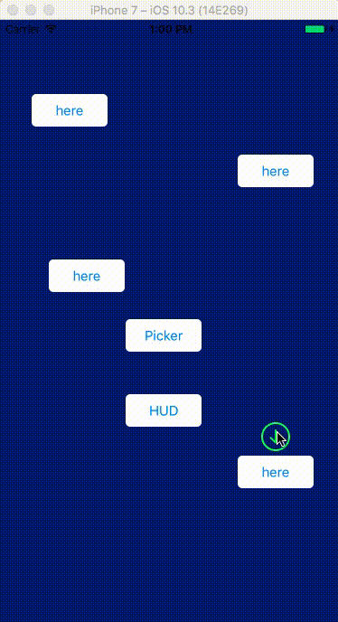

# UIViewAnimationTutorial

 demo according from  
 https://www.raywenderlich.com/5478/uiview-animation-tutorial-practical-recipes  
[UIView Animation Tutorial](https://www.raywenderlich.com/5478/uiview-animation-tutorial-practical-recipes)   

demo 




## 1、改变位置CGPoint  

```
- (void) moveTo:(CGPoint)destination duration:(float)secs option:(UIViewAnimationOptions)option
{
    [UIView animateWithDuration:secs delay:0.0 options:option
        animations:^{
            self.frame = CGRectMake(destination.x,destination.y, self.frame.size.width, self.frame.size.height);
        }
        completion:nil];
}
```

## 2、改变大小，旋转CGAffineTransform   
**Probably the most powerful animatable property on UIView is transform, which takes a CGAffineTransform. This is a matrix that expresses how each pixel of the UIView should be modified, applying some math formulas.
Don’t worry, you don’t actually have to remember linear algebra, because there are some built-in CGAffineTransforms to make life nice and simple. We’ll focus on two of them:
CGAffineTransformScale: Allows you to scale a view up or down, optionally using different factors for the x and y axes. A value of 10.0 means “make the view 10 times bigger than the actual frame.” Please note that applying this transform may invalidate the Frame property.
CGAffineTransformRotate: Allows you to rotate a view by a given angle. It uses radians, the standard unit of angular measure. One radian is equal to 180/π degrees. **  

```
- (void) downUnder:(float)secs option:(UIViewAnimationOptions)option
{
    [UIView animateWithDuration:secs delay:0.0 options:option
         animations:^{
             self.transform = CGAffineTransformRotate(self.transform, M_PI);
         }
         completion:nil];
}
```  
## 3、动画的变换过程Animation Curves，比如 慢 --> 快 --> 慢  
What you are seeing is the default “curve” for UIView animations. Curves are actually acceleration curves that describe the speed variations of the animation. There are 4 curves available:  

* UIViewAnimationOptionCurveEaseInOut: start slow, speed up, then slow down
* UIViewAnimationOptionCurveEaseIn: start slow, speed up, then suddenly stop
* UIViewAnimationOptionCurveEaseOut: start fast, then slow down until stop
* UIViewAnimationOptionCurveLinear: constant speed  


UIViewAnimationOptionCurveEaseInOut is the default because the effect seems very “natural.” But of course, “natural” depends on what you want to do.

```
- (void) addSubviewWithZoomInAnimation:(UIView*)view duration:(float)secs option:(UIViewAnimationOptions)option
{
    // first reduce the view to 1/100th of its original dimension
    CGAffineTransform trans = CGAffineTransformScale(view.transform, 0.01, 0.01);
    view.transform = trans;	// do it instantly, no animation
    [self addSubview:view];
    // now return the view to normal dimension, animating this tranformation
    [UIView animateWithDuration:secs delay:0.0 options:option
        animations:^{
            view.transform = CGAffineTransformScale(view.transform, 100.0, 100.0);
        }
        completion:nil];	
}

- (void) removeWithZoomOutAnimation:(float)secs option:(UIViewAnimationOptions)option
{
	[UIView animateWithDuration:secs delay:0.0 options:option
    animations:^{
        self.transform = CGAffineTransformScale(self.transform, 0.01, 0.01);
    }
    completion:^(BOOL finished) { 
        [self removeFromSuperview]; 
    }];
}
```

## 4、透明度Alpha Channel，以及动画叠加  
To create really complex gaming-type animations, it’s probably better to use OpenGL or Cocos2D, but don’t underestimate the power of UIKit.
Also keep in mind that another property you can animate is the Alpha Channel. This makes it really easy to create fade effects, which is another nice way to add/remove subview.  

```
// add with a fade-in effect
- (void) addSubviewWithFadeAnimation:(UIView*)view duration:(float)secs option:(UIViewAnimationOptions)option
{
	view.alpha = 0.0;	// make the view transparent
	[self addSubview:view];	// add it
	[UIView animateWithDuration:secs delay:0.0 options:option
                     animations:^{view.alpha = 1.0;}
                     completion:nil];	// animate the return to visible 
}

// remove self making it "drain" from the sink!
- (void) removeWithSinkAnimation:(int)steps
{
	NSTimer *timer;
	if (steps > 0 && steps < 100)	// just to avoid too much steps
		self.tag = steps;
	else
		self.tag = 50;
	timer = [NSTimer scheduledTimerWithTimeInterval:0.05 target:self selector:@selector(removeWithSinkAnimationRotateTimer:) userInfo:nil repeats:YES];
}
- (void) removeWithSinkAnimationRotateTimer:(NSTimer*) timer
{
	CGAffineTransform trans = CGAffineTransformRotate(CGAffineTransformScale(self.transform, 0.9, 0.9),0.314);
	self.transform = trans;
	self.alpha = self.alpha * 0.98;
	self.tag = self.tag - 1;
	if (self.tag <= 0)
	{
		[timer invalidate];
		[self removeFromSuperview];
	}
}
```

